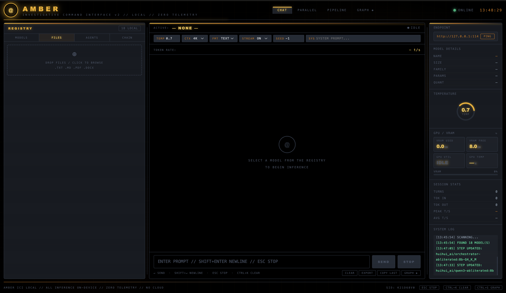

<p align="center">
  
</p>

<p align="center">
  
</p>

<p align="center">
  Professional investigative command UI over Ollama with a zero-telemetry workflow.
</p>

## What This Is

This project serves a single-file command interface with clear mode separation:

- Top modes: `CHAT`, `PARALLEL`, `PIPELINE`, `GRAPH`
- Left workflow tabs: `MODELS`, `FILES`, `AGENTS`, `CHAIN`
- Local Ollama-only runtime on `127.0.0.1`
- Session stats, GPU/VRAM panel, system log, and export

UI entry file is now:

- `files/amber_ui.html`

## Start

1. Start Ollama:
```bash
ollama serve
```

2. Start the UI:
```bash
npm start
```

3. Open:
`http://127.0.0.1:8765/amber_ui.html`

Optional:
```bash
npm run start:browser
```

## UI Reference

Target/expected UI reference image:

<p align="center">
  
</p>

## Runtime Behavior

### Chat (`CHAT`)

- Direct prompt/response with the active model.
- Uses top runtime controls (`TEMP`, `CTX`, `FMT`, `STREAM`, `SEED`, `SYS`).

### Parallel (`PARALLEL`)

- Runs checked models concurrently.
- Uses shared conversation context.

### Agents (`AGENTS`)

- Configure autonomous units with model + system prompt + mode.
- `RUN` executes one agent.
- `RUN CHAIN` executes the agent orchestration loop.

### Chain (`CHAIN` / pipeline builder)

- Build ordered multi-step prompt stages.
- Each step output feeds the next step.
- Save/load/delete named chain sets.
- `RUN` executes current chain steps.

## Persistence

Saved runtime configuration is browser-local (`localStorage`):

- `oci_agents_v1`
- `oci_pipeline_v1`
- `oci_agent_sets_v1`
- `oci_chain_sets_v1`
- `oci_layout_v1`

## Security

- Localhost-only endpoint policy in both launcher and UI CSP.
- No remote domains in `connect-src`.
- Local binding by default (`127.0.0.1`).

## Project Layout

```text
.
├── README.md
├── package.json
├── modhistory.txt
├── image/
│   └── README/
│       ├── 06b51b0b-382c-46e8-9942-6163001684c0.png
│       └── 7w7f8wgwefgfiau.png
└── files/
    ├── launch_amber_ici_gui.py
    └── amber_ui.html
```
