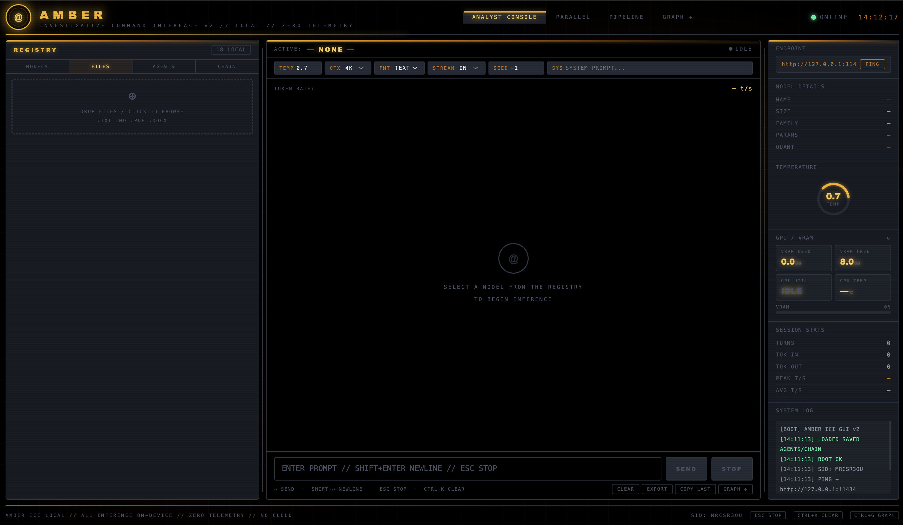

<p align="center">
  
</p>

<p align="center">
  
</p>

## About

Industrial-grade local Ollama command center with multi-model orchestration, live token streaming, graph-based output correlation, investigative file ingestion, agent pipelines, and GPU telemetry. Built for local-first analysis, OSINT workflows, transcript ingestion, OCR extraction, and model chaining.

## Interface Preview

<p align="center">
  
</p>

## Platform Profile

- Primary workspace: `ANALYST CONSOLE`
- Additional execution modes: `PARALLEL`, `PIPELINE`, `GRAPH`
- Left registry panes: `MODELS`, `FILES`, `AGENTS`, `CHAIN`
- Runtime visibility: model details, GPU/VRAM readouts, session stats, and system log
- UI entry point: `files/amber_ui.html`

## Quick Start

1. Start Ollama:
```bash
ollama serve
```

2. Start AMBER ICI:
```bash
npm start
```

3. Open:
`http://127.0.0.1:8765/amber_ui.html`

Optional browser auto-open:
```bash
npm run start:browser
```

## Operational Modes

### Analyst Console (`ANALYST CONSOLE`)

- Direct single-model interaction for focused investigative questioning.
- Uses runtime controls: `TEMP`, `CTX`, `FMT`, `STREAM`, `SEED`, `SYS`.
- `SEND` is tied to single-model analyst console execution.

### Parallel (`PARALLEL`)

- Executes prompt runs across checked models concurrently.
- Useful for comparison, divergence checks, and consensus sampling.

### Agents (`AGENTS`)

- Defines reusable agent cards (model + role + execution mode + output target).
- Per-card `RUN` executes one agent.
- Bottom `RUN` executes the configured agent orchestration set.

### Chain (`CHAIN`)

- Defines ordered, multi-step pipeline stages.
- Step output feeds subsequent steps for deterministic flow.
- Bottom `RUN CHAIN` executes the chain when step cards are present.

## Security Posture

- Localhost-restricted endpoint validation in UI logic.
- Localhost-restricted `connect-src` in CSP.
- No external domain telemetry paths configured in this project.
- Default endpoint is `http://127.0.0.1:11434`.

## Persistence

Configuration state is stored client-side in browser `localStorage`:

- `oci_agents_v1`
- `oci_pipeline_v1`
- `oci_agent_sets_v1`
- `oci_chain_sets_v1`
- `oci_layout_v1`

## Project Layout

```text
.
├── README.md
├── package.json
├── modhistory.txt
├── image/
│   └── README/
│       ├── 06b51b0b-382c-46e8-9942-6163001684c0.png
│       └── lksjofuh3297afw9e7ywhf.png
└── files/
    ├── launch_amber_ici_gui.py
    └── amber_ui.html
```
