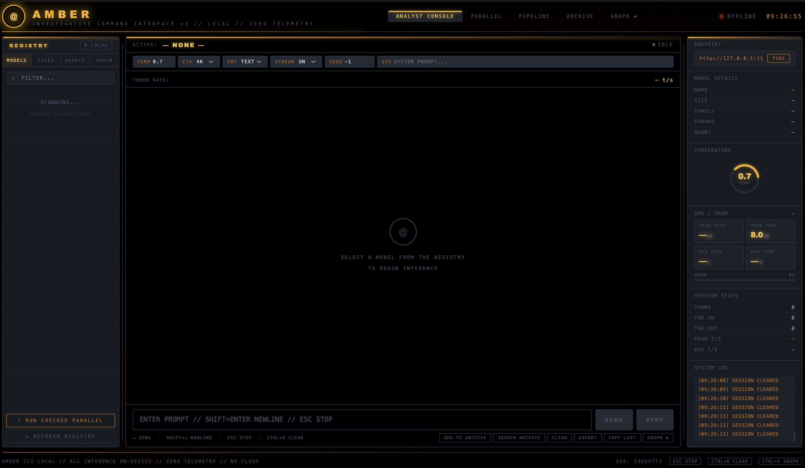
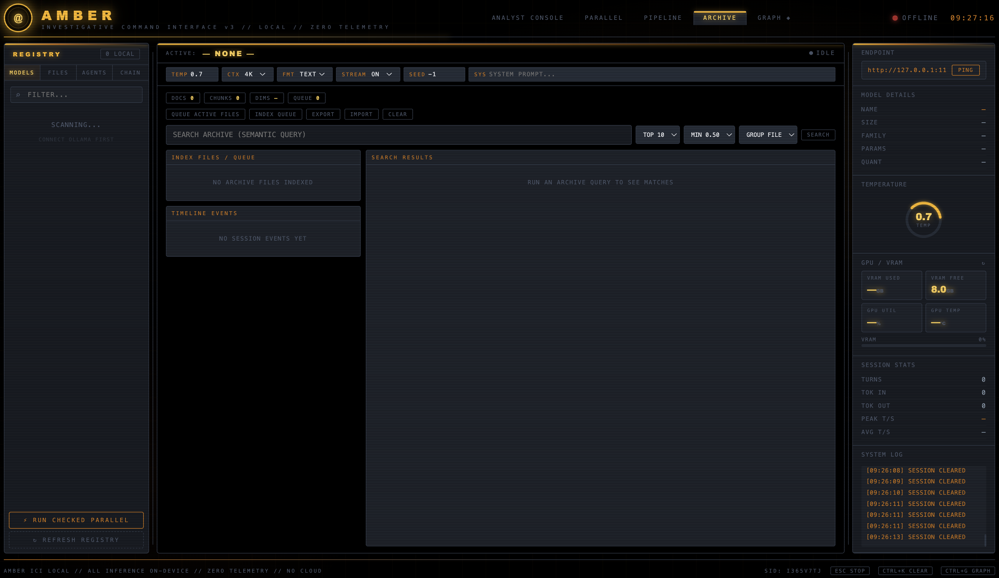

<p align="center">
  
</p>

# AMBER ICI v4

AMBER ICI (AMBER Investigative Command Interface) is a local-first Ollama command interface for investigative and analytical workflows.

It provides:
- Analyst Console for direct model interaction
- Parallel model execution
- Agent orchestration with loops
- Chain/Pipeline execution with loops
- Integrated local Archive (semantic vector index/search)
- Fibonacci fractal memory retrieval for active-file context injection
- Standalone Entity Provenance Graph (`amber_graph.html`)
- Standalone Timeline view (`amber_timeline.html`)
- Standalone Vector Store manager (`amber_vectorstore.html`)
- Local file ingestion with PDF/DOCX/TXT/MD/PY extraction
- OCR fallback for PDFs (when OCR dependencies are installed)
- Local runtime telemetry (token rate, session stats, GPU/VRAM)

All inference is intended to run locally against Ollama (`127.0.0.1`/`localhost`).

## v4 Update Highlights

> **Note:** this section documents the *originally planned* v4 storage layer. The `synapse.db` SQLite
> migration described below was not carried into the shipped launcher — see [Persistence Model](#persistence-model)
> for what actually runs today (`state/*.json` via the atomic JSON store API). The rest of this section
> (memory/context/agent behavior) is accurate.

`v4` introduces persistent memory, headless web access, expanded file ingestion, and row-level vector storage:

- Program state persists to `state/*.json`, written atomically per key via `/api/store/<domain>/<name>`.
- Archive index (vector store) persists to `state/vector_store.json`, hydrated into an in-browser fractal/vector store on load.
- Chat history persisted to `state/chat_history.json` and restored on every boot (last 100 messages kept; last 30 replayed in UI).
- Scratchpad persisted to `state/scratch.json` and restored on every boot.
- Context window overflow protection added: `trimMsgsToCtx()` trims oldest non-system messages to a 90% char budget before every inference call.
- Agents now receive the last 6 conversation turns as context (previously received zero history).
- Memory profile setting moved from `localStorage` to `state/memory_profile.json`.
- Headless Firefox internet access toggle (`WEB OFF / ON`) added to the cpills bar.
  - New `POST /api/web/fetch` endpoint backed by `camoufox` (Playwright-based, fingerprint-spoofing headless Firefox).
  - Results cached in `state/web_cache.json` with a 1-hour TTL.
  - Degrades gracefully if `camoufox` is not installed.
- `.py` file ingestion added — Python source files are accepted and read as plain text.

## v3 Update Highlights

`v3` introduces the expanded operational workflow and storage/runtime hardening:

- UI identity updated to `v3`.
- Integrated `ARCHIVE` mode in the main UI for semantic indexing/search.
- Added standalone tools:
  - `amber_timeline.html`
  - `amber_vectorstore.html`
- Disk-backed persistence moved to `state/*.json` (away from browser-only state).
- Disk-backed uploads under `uploads/blobs`, `uploads/texts`, and `uploads/manifest.json`.
- Agent and Chain/Pipeline enhancements:
  - edit support
  - drag/drop reordering
  - loop execution controls
- Unified STOP handling across Analyst, Parallel, Agents, and Pipeline runs.
- CTX now applied consistently across Analyst, Parallel, Agents, and Pipeline inference calls.
- Automatic file-context budgeting and relevance trimming for large active file context.
- Scratchpad injection cap for `{{scratchpad}}` templates.
- Session/token telemetry now updates during Agent and Pipeline execution (not only Analyst).
- Graph enhancements for inferred property/similarity-based node connections.
- PDF ingestion now includes OCR fallback (`ocrmypdf` + `tesseract`) when available.
- Added Fibonacci fractal memory indexing/retrieval path for active file context.

<p align="center">
  <a href="image/README/feouahwofu23978.png" target="_blank" rel="noopener noreferrer">
    
  </a>
  <a href="image/README/askjhf949qhgh.png" target="_blank" rel="noopener noreferrer">
    
  </a>
</p>

<p align="center"><sub>Click either image to open full size.</sub></p>

## Core Design

- Local-only launcher and CSP policy (no external domains configured)
- All runtime state persisted to `state/*.json` — no browser-only state
- Archive index persisted to `state/vector_store.json`
- Disk-backed uploads (`uploads/blobs`, `uploads/texts`, `uploads/manifest.json`)
- Unified STOP control for active runs
- CTX-driven prompt budget applied across Analyst, Parallel, Agents, and Pipeline
- Hierarchical Fibonacci fractal memory retrieval with beam-search routing (when available)

## Requirements

- Python 3.10+
- Ollama installed and running locally
- Node/npm (only used to run convenience scripts)
- Required embed model for archive/index features:
  - `embeddinggemma:latest`

OCR support for scanned/visual PDFs (optional):
- `ocrmypdf`
- `tesseract`

If OCR tools are unavailable, AMBER still runs; PDF extraction falls back to basic text extraction.

Headless web fetch support (optional):
- `camoufox` (Python package — Playwright-based, auto-spoofs browser fingerprints)

If camoufox is not installed, the `WEB` toggle appears in the UI but fetch calls degrade gracefully with an error response.

## Install And Setup

### 1. Clone and enter project

```bash
git clone https://github.com/gs-ai/AMBER-ICI.git
cd AMBER-ICI
```

### 2. Start Ollama

```bash
ollama serve
```

### 3. Pull required models

Required for Archive indexing/search:

```bash
ollama pull embeddinggemma:latest
```

Pull any generation models you plan to use (examples):

```bash
ollama pull deepseek-r1:7b
ollama pull qwen2.5-coder:7b
ollama pull dolphin-llama3:latest
```

### 4. (Recommended) Install OCR tools for PDF ingestion

macOS (Homebrew):

```bash
brew install ocrmypdf tesseract
```

Ubuntu/Debian:

```bash
sudo apt-get update
sudo apt-get install -y ocrmypdf tesseract-ocr
```

Windows:
- Install `Tesseract OCR`
- Install `OCRmyPDF`
- Ensure both are available in your `PATH`

### 5. (Recommended) Install Camoufox for headless web fetch

No conda environment is required. Standard pip install:

```bash
pip install camoufox
python3 -m camoufox fetch
```

Camoufox bundles its own patched Firefox binary and auto-generates realistic browser fingerprints (OS, fonts, screen, WebGL, headers) to bypass bot detection on heavily guarded sites. No geckodriver, no webdriver-manager, no separate Firefox install needed.

If camoufox is not installed, AMBER still runs. The `WEB` toggle will be visible in the UI but fetch calls will return an error response instead of live results.

### 6. Launch AMBER ICI

Browser auto-open:

```bash
npm run start:browser
```

No auto-open:

```bash
npm start
```

Direct Python launch (same backend):

```bash
python3 files/launch_amber_ici_gui.py --host 127.0.0.1 --port 8765
```

Open:

- `http://127.0.0.1:8765/amber_ui.html`

## Launcher Options

```bash
python3 files/launch_amber_ici_gui.py --help
```

Supported flags:
- `--host` (default `127.0.0.1`)
- `--port` (default `8765`)
- `--no-browser`
- `--gui PATH`

## First-Run Workflow

1. Confirm endpoint (top-right): `http://127.0.0.1:11434`
2. Click `PING`
3. Select one model in `MODELS`
4. Use `ANALYST CONSOLE` to send prompt
5. Upload files in `FILES` (optional)
6. Mark uploaded files active so they become context for runs

## Workspaces And How They Run

### Analyst Console

Use for direct single-model interaction.

- `SEND` activates when exactly one active model context is selected
- Supports system prompt, stream toggle, JSON output mode, CTX setting, seed
- `STOP` / `ESC` aborts active run

### Parallel

Run the same prompt across checked models.

- Select multiple models via checkboxes
- Click `RUN CHECKED PARALLEL`
- Per-model outputs stream independently

### Agents

Card-based orchestration with execution modes.

- Add/Edit/Delete agents
- Reorder agent cards by drag-and-drop
- Set loop count (`LOOPS`)
- `RUN` under Agents executes the configured agent chain

### Chain / Pipeline

Ordered step execution using templates.

- Add/Edit/Delete steps
- Template supports `{{input}}` and `{{scratchpad}}`
- Reorder steps by drag-and-drop
- Set loop count (`LOOPS`)
- `RUN CHAIN` executes current steps

### Archive (Integrated)

Local semantic archive in the main UI.

- Queue active files
- Index queued files with `embeddinggemma:latest`
- Search by semantic similarity
- Export/import archive JSON
- Add last assistant output to archive directly
- File-source archive indexing also builds a Fibonacci fractal memory tree in runtime state

## File Ingestion

Accepted types:
- `.txt`, `.md`, `.pdf`, `.docx`, `.py`

Limits:
- Max upload size: `32 MB` per file

Storage:
- Raw bytes: `uploads/blobs/`
- Extracted text: `uploads/texts/`
- File metadata: `uploads/manifest.json`

`.py` files are treated as plain-text — content is read directly with no transformation.

PDF extraction behavior:
- Basic text extraction always attempted
- OCR fallback attempted when `ocrmypdf` is available
- Better of basic vs OCR text is saved as extracted text

## Context Budgeting (Current Runtime Behavior)

AMBER applies context controls automatically:

- CTX applies to Analyst, Parallel, Agents, and Pipeline requests
- Active file-context injection path:
  - first tries Fibonacci fractal retrieval against active file entries (when fractal store is available)
  - falls back to flat file-context assembly if no fractal hits are available
- Active file context budget is capped to approximately:
  - `maxChars = CTX * 3`
- If active file context exceeds budget:
  - it is trimmed using simple relevance scoring (keyword overlap)
- `{{scratchpad}}` injection is tail-capped:
  - min ~8k chars, max ~20k chars
  - additionally bounded by file-context budget

This reduces prompt overflow and keeps runs stable as file volume increases.

## v4 Memory / Token Window

AMBER ICI v4 applies context management across all run modes:
- Analyst Console
- Parallel
- Agents
- Chain/Pipeline

Supported CTX window options in UI:
- `2K`, `4K`, `8K`, `16K`, `32K`

Context retrieval path (current):
- `trimMsgsToCtx()` trims oldest non-system messages to a 90% character budget (~4 chars/token) before every inference call.
- Agents receive the last 6 conversation turns in addition to their system prompt and current input.
- Fibonacci fractal memory is queried first for active file context (`beamWidth=3`, up to depth `4`, top `5` hits); falls back to flat assembly if no fractal hits are available.
- Prompt budgeting guardrail: active file context is capped at approximately `CTX * 3` characters before final prompt assembly.

Expected behavior:
- Higher relevance per injected character for larger/multi-file contexts.
- Lower overflow pressure because low-signal blocks are less likely to be injected.
- If fractal memory is empty (not indexed yet), behavior matches the flat path.

Approximate active file-context budget by CTX:
- `2K` CTX: ~6,000 chars
- `4K` CTX: ~12,000 chars
- `8K` CTX: ~24,000 chars
- `16K` CTX: ~48,000 chars
- `32K` CTX: ~96,000 chars

Scratchpad behavior:
- `{{scratchpad}}` injection is tail-limited (~8k to ~20k chars)
- Also bounded by the current CTX-derived file-context budget

## Session Stats And Telemetry

Right panel session stats update during:
- Analyst runs
- Parallel runs
- Agent runs
- Pipeline runs

Tracked fields:
- Turns
- Tok In
- Tok Out
- Peak T/S
- Avg T/S
- Live token rate sparkline

## Persistence Model

> **Correction (2026-07-10):** the `synapse.db` SQLite migration described in earlier drafts of this
> README was never wired into the running launcher. `files/launch_amber_ici_gui.py` has no `sqlite3`
> import and reads/writes `state/*.json` exclusively. `synapse.db` may exist on disk from an earlier
> attempt but nothing in the codebase opens it. The table below and the "Data Hygiene" reset commands
> have been corrected to describe the actual, current persistence layer.

All runtime state is persisted as individual JSON files under `state/`, written atomically (temp file +
`Path.replace()`) by the launcher's generic `/api/store/<domain>/<name>` endpoint.

File overview:

| File | Contents |
|---|---|
| `state/agents_state.json`, `state/agent_sets.json` | Agent configs (live + saved presets) |
| `state/pipeline_state.json`, `state/chain_sets.json` | Pipeline steps and saved chain sets |
| `state/chat_history.json` | Conversation log (last 100 messages kept) |
| `state/scratch.json` | Scratchpad contents |
| `state/memory_profile.json` | Memory profile setting |
| `state/timeline_state.json`, `state/graph_state.json` | Timeline and entity-graph state |
| `state/vector_store.json` | Archive index (in-browser fractal/vector store is rebuilt from this on load) |
| `state/web_cache.json` | Headless web fetch results, cached by query with a 1-hour TTL |
| `uploads/manifest.json` | File upload metadata (id, name, size, ext, paths); blobs/text under `uploads/blobs`, `uploads/texts` |

There is no database migration step — `state/*.json` is read directly on every request and is the
single source of truth today.

## Standalone Tools

All three standalone tools are launchable directly from the main UI header nav (`GRAPH ◈`, `TIMELINE ▶`, `VECTORS ◉`) or from the console action bar. Each can also be opened directly in a browser tab:

- Entity Provenance Graph: `http://127.0.0.1:8765/amber_graph.html`
- Timeline UI: `http://127.0.0.1:8765/amber_timeline.html`
- Vector Store manager: `http://127.0.0.1:8765/amber_vectorstore.html`

All persist state via the `/api/store/<domain>/<name>` JSON store API described above. The Graph auto-polls every 10 seconds and reflects changes from active inference in the main UI in near real-time.

## Security Posture

- Launcher binds to localhost by default (`127.0.0.1`)
- CSP `connect-src` restricted to localhost addresses
- Referrer/permissions hardened in launcher headers
- No cloud endpoint is configured in this repo by default

## Data Hygiene / Cleanup

Reset all state (agents, pipelines, archive index, chat history, web cache, timeline/graph state):

```bash
rm -f state/*.json
```

Files are recreated with empty defaults on next read — no migration/rebuild step is needed.

Remove uploaded source files, extracted text, and the upload manifest:

```bash
rm -rf uploads/blobs uploads/texts uploads/manifest.json
```

`synapse.db`, if present from an earlier build, is inert and can be deleted independently — nothing in
the current codebase reads or writes it.

## Troubleshooting

### Web fetch is always returning errors

- Install camoufox: `pip install camoufox && python3 -m camoufox fetch`
- No conda environment is required — standard `pip install` into your Python environment is sufficient
- Some heavily bot-protected sites (e.g. sites behind Cloudflare Turnstile) may still block fetches regardless of fingerprint spoofing

### Archive indexing fails with HTTP 500

Check:
- Embed model present: `ollama pull embeddinggemma:latest`
- Ollama running and reachable at `127.0.0.1:11434`
- PDF is text-extractable or OCR dependencies are installed

### PDF extracted text is poor

- Install OCR dependencies (`ocrmypdf`, `tesseract`)
- Re-upload PDF so extraction re-runs with OCR path
- Inspect saved text in `uploads/texts/<FILE_ID>.txt`

### SEND button disabled

`SEND` is enabled only when single-model send conditions are met.
Use:
- One active model for Analyst send
- Parallel button when running checked multi-model mode

### Port already in use

Use another port:

```bash
python3 files/launch_amber_ici_gui.py --host 127.0.0.1 --port 8877
```

## Project Layout

```text
AMBER/
├── files/
│   ├── amber_graph.html
│   ├── amber_timeline.html
│   ├── amber_ui.html
│   ├── amber_vectorstore.html
│   └── launch_amber_ici_gui.py
├── image/
│   └── README/
├── state/
│   ├── agent_sets.json
│   ├── chain_sets.json
│   ├── pipeline_state.json
│   └── timeline_state.json
├── uploads/
│   ├── blobs/
│   └── texts/
├── package.json
├── README.md
├── synapse.db
└── LICENSE
```
